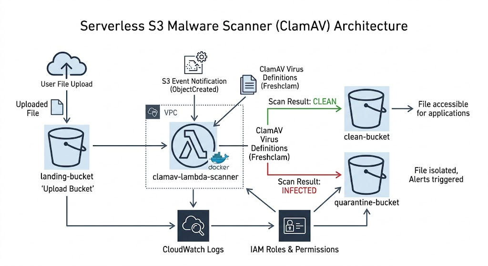
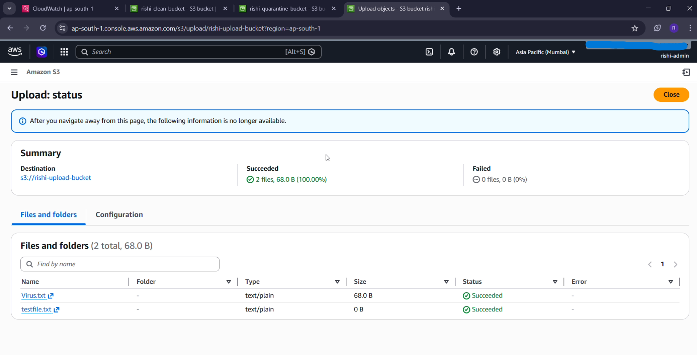
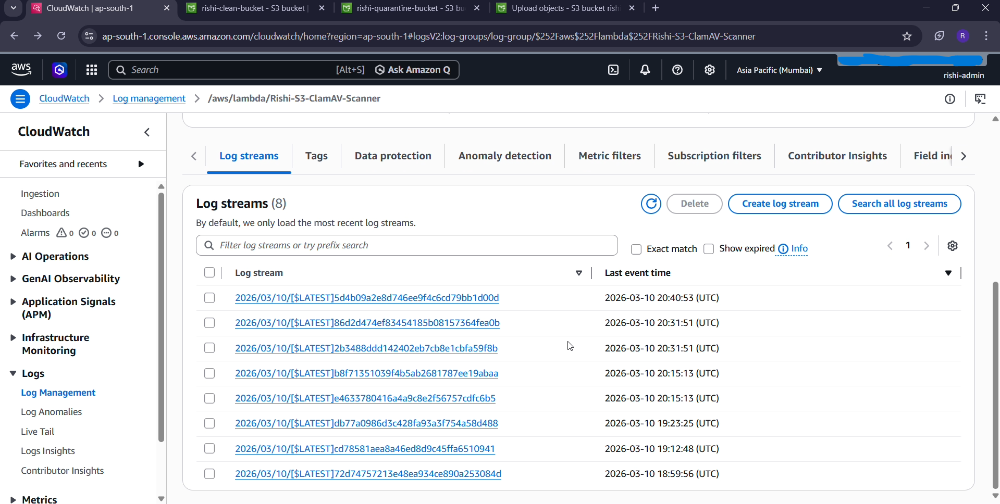
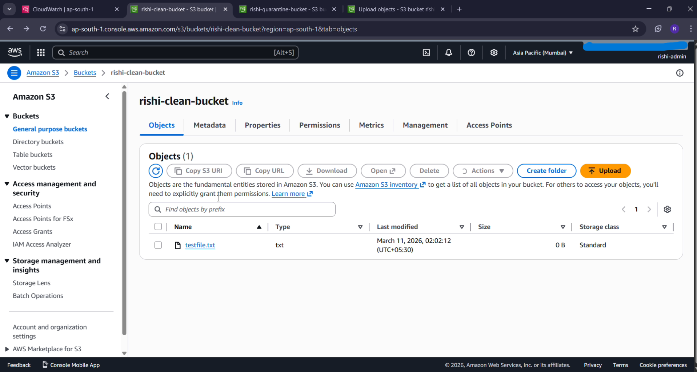
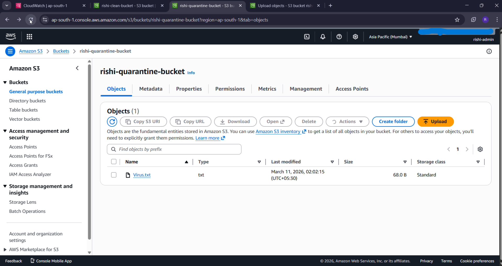

# S3 Antivirus Pipeline (ClamAV)

A **serverless, event-driven malware scanning pipeline** for Amazon S3 using **AWS Lambda, Docker, and ClamAV**.

When a file is uploaded to an S3 bucket, it is automatically scanned for malware and routed to either a **clean bucket** or a **quarantine bucket**.

---

# Problem & Solution

## The Problem

Users can upload malicious files to public S3 buckets, which can infect downstream users or internal systems.

## The Solution

This project implements a **serverless security gate**.

1. A file is uploaded to the **Upload Bucket**
2. An **S3 Event Notification** triggers a Lambda function
3. The Lambda function runs **ClamAV inside a Docker container**
4. The file is scanned
5. Based on the result:

- **Clean → moved to Clean Bucket**
- **Infected → moved to Quarantine Bucket**

---

# Architecture



---

# Tech Stack

- **Amazon S3** – File storage  
- **AWS Lambda** – Serverless compute  
- **Docker** – Containerized runtime  
- **ClamAV** – Open source antivirus engine  
- **AWS CloudWatch** – Logging and monitoring  
- **Amazon ECR** – Container image registry  

---

# Implementation Details

## Event Trigger

The pipeline is automated using **S3 Event Notifications**.

Any `ObjectCreated` event in the upload bucket automatically triggers the Lambda scanner.

## Containerized Scanner

ClamAV requires:

- Linux libraries  
- Virus definition databases  
- System dependencies  

To solve this, the scanner is packaged inside a **Docker container** and deployed to **AWS ECR**, which allows Lambda to run the scanner without hitting the **50MB Lambda layer limit**.

---

# Testing

To verify the pipeline, two files were uploaded:

- `testfile.txt` (clean file)
- `virus.txt` (simulated malware file)

## Upload Bucket



## Lambda Execution Logs



## Clean Bucket



## Quarantine Bucket



The system successfully scanned both files and automatically sorted them into the correct buckets.

---

# Monitoring & Logs

All scan results are logged in **AWS CloudWatch**, providing visibility for:

- scan results  
- debugging  
- security auditing  

---

# Skills Demonstrated

- **Cloud Security** – Malware scanning and quarantine pattern  
- **Serverless Architecture** – Event-driven pipeline with AWS Lambda  
- **Containerization** – Running ClamAV in Docker  
- **IAM Security** – Least privilege permissions for S3 and Lambda  
- **Cloud Monitoring** – Logging and observability with CloudWatch  

---

# How to Run

## 1. Clone the repository

```bash
git clone https://github.com/yourusername/s3-antivirus-pipeline.git
```

## 2. Build the Docker image

```bash
docker build -t clamav-lambda .
```

## 3. Push the image to AWS ECR

## 4. Deploy the Lambda function using the container image

## 5. Configure S3 Event Notifications to trigger the Lambda scanner
